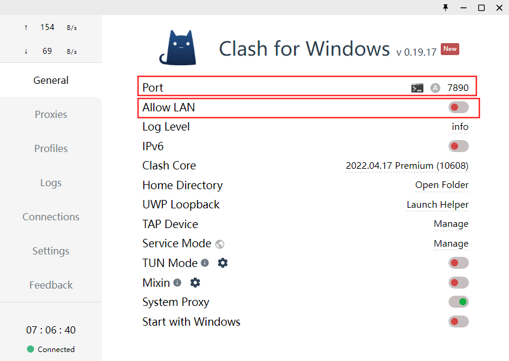
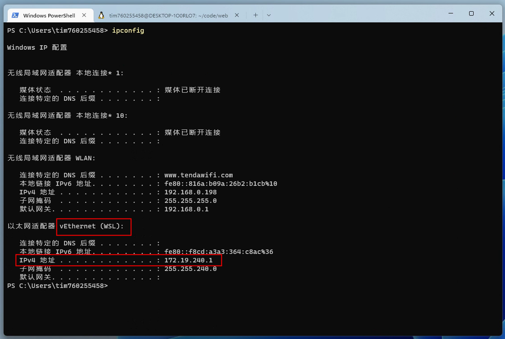

# Windows + WSL 踩坑记录

## 使用代理（以 clash-for-window 为例）
更新：这里说的没用，直接打开 clash 的 TUN 模式吧

1. 打开 clash-for-window 的 Allow LAN 选项

2. 以管理员身份打开 Windows 命令行，输入
```bash
New-NetFirewallRule -DisplayName "WSL" -Direction Inbound  -InterfaceAlias "vEthernet (WSL)"  -Action Allow
```
这会添加一条防火墙规则允许 WSL 对 Windows 的访问

3. 命令行输入 wget youtube.com 检验下成功没

## WSL 使用 Windows 的 git 凭证

1. 按照 Windows 的文档安装 [git](https://docs.microsoft.com/zh-cn/windows/wsl/tutorials/wsl-git)，一定要设置[凭据管理器](https://docs.microsoft.com/zh-cn/windows/wsl/tutorials/wsl-git#git-credential-manager-setup)

2. 没有生成过 git 凭证的，按照 github 指南生成 [adding-a-new-ssh-key-to-your-github-account](https://docs.github.com/en/authentication/connecting-to-github-with-ssh/adding-a-new-ssh-key-to-your-github-account)

3. 进入 wsl， clone 下 giuhub 代码，会弹窗提示你把 github 与凭据绑定，按照提示操作

4. 如果 clone 提示网络问题，设置 git 代理，不提示不用设置
```bash
git config --global http.proxy 127.0.0.1:1080
git config --global https.proxy 127.0.0.1:1080
```
127.0.0.1 替换成 wsl 的 ip，1080 替换成 clash-for-window 的 Port。wsl 的 ip 可以在命令行里执行 ipconfig 查看



